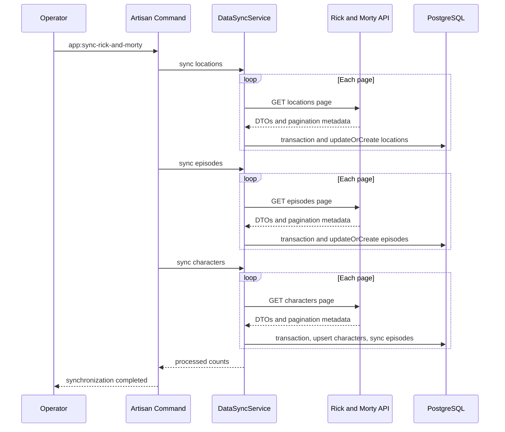
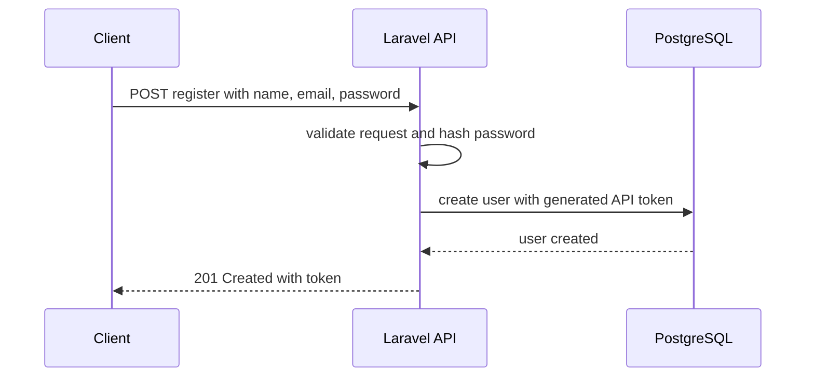
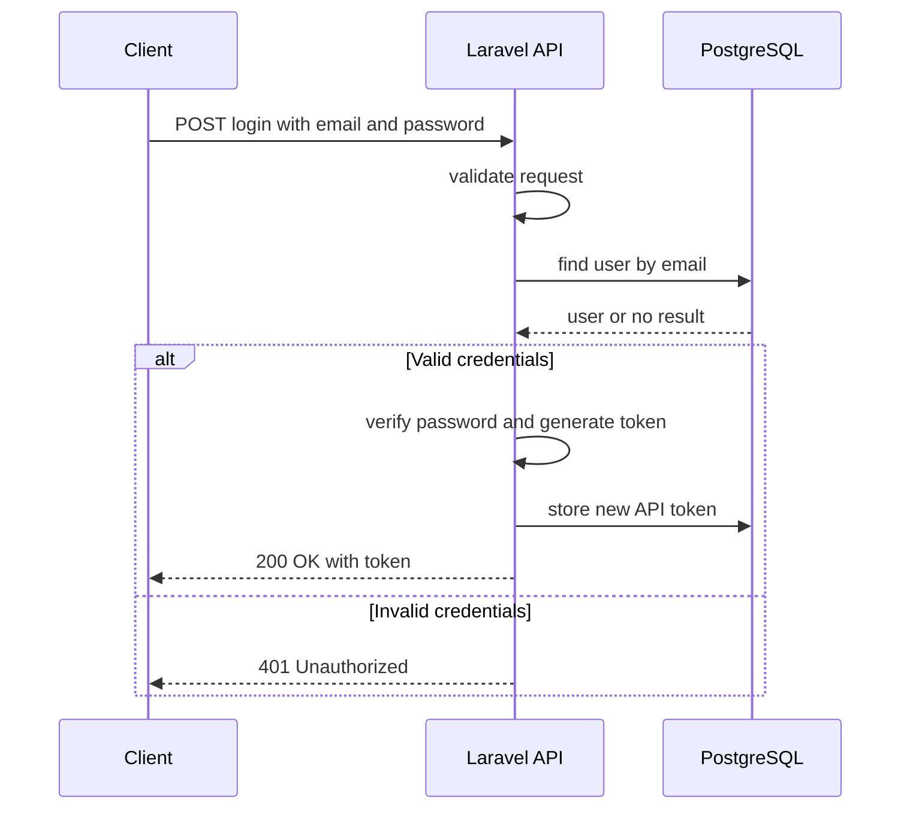
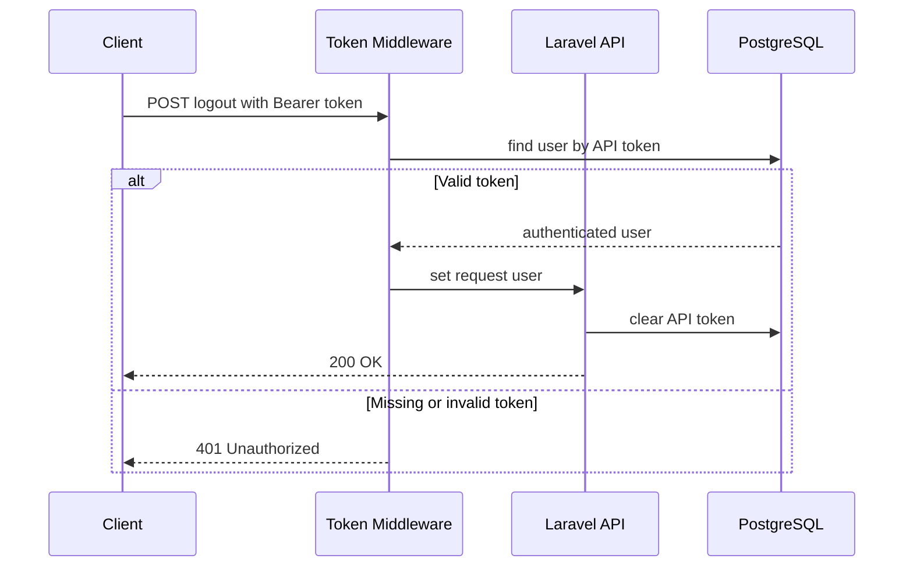
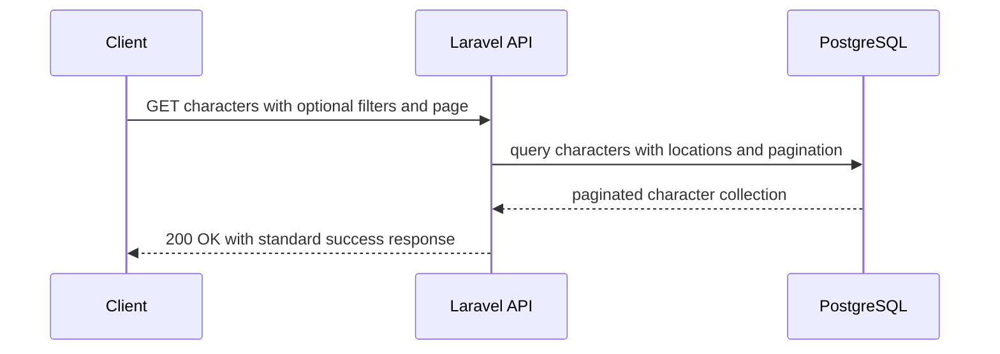
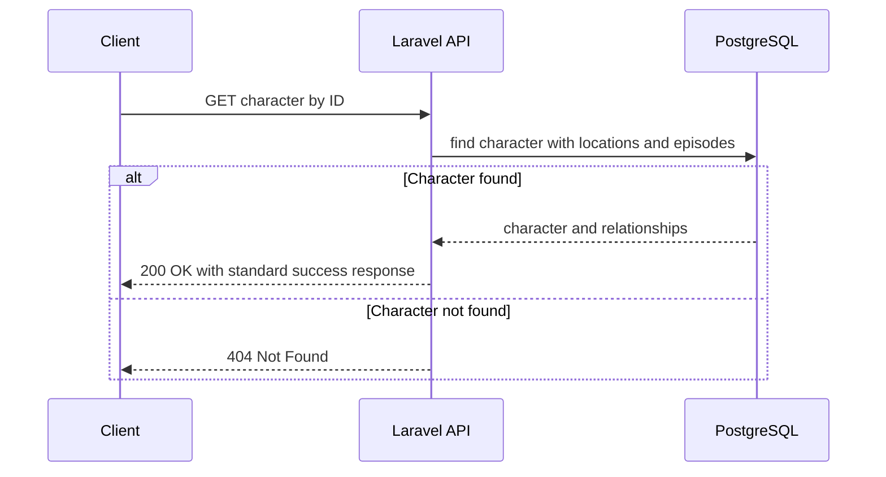
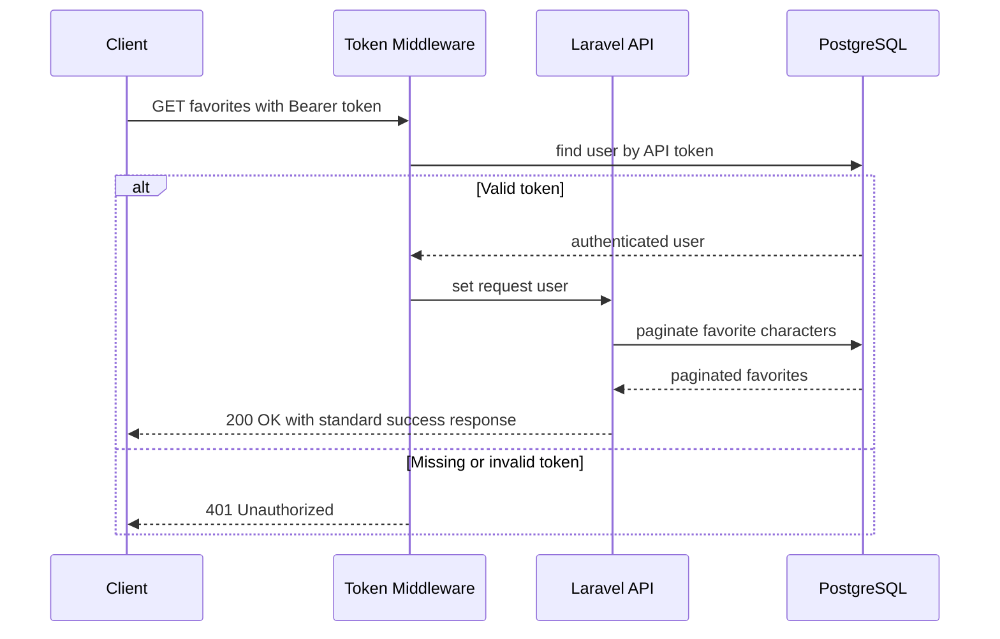
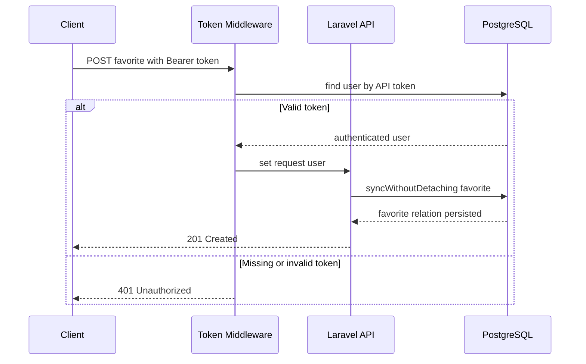
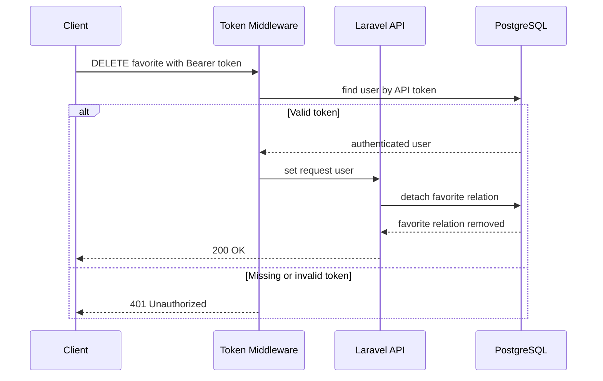

# Rick and Morty API

[](https://www.php.net/)
[](https://laravel.com/)
[](https://www.postgresql.org/)
[](https://www.docker.com/)

REST API for synchronizing and querying Rick and Morty characters, locations, and episodes. It includes character filtering, custom Bearer token authentication, and favorite management.

## Prerequisites

- Docker Desktop o Docker Engine.
- Docker Compose.

## Installation

```bash
git clone https://github.com/GabrielTGDev/rick-and-morty.git
cd rick-and-morty
cp .env.example .env
```

> Update the `.env` information (database settings and `WWWUSER` and `WWWGROUP` IDs).

```bash
./vendor/bin/sail up -d
./vendor/bin/sail artisan migrate
./vendor/bin/sail artisan app:sync-rick-and-morty
./vendor/bin/sail artisan test
```

The synchronization downloads data from the public Rick and Morty API and persists it locally. Once started, the API is available at `http://localhost:8000`.

## Architectural Decisions

- **PostgreSQL and JSONB:** normalized data is stored in relational tables, while the original external API response is retained in `JSONB`. This supports auditing and mapping evolution without losing information.
- **Decoupled HTTP client and DTOs:** the external client contract, HTTP implementation, and DTOs separate network communication from persistence. This improves type safety, testing with `Http::fake()`, and provider substitution.
- **Custom token authentication:** a Bearer token stored on the user and custom middleware meet the authentication requirement without adding external authentication dependencies.
- **Idempotency and fault tolerance:** `updateOrCreate()` and relationship synchronization prevent duplicates on repeated executions. The client applies timeouts and retries, while each page is processed in a transaction to preserve previously synchronized data if a partial failure occurs.

## Sequence Diagrams

<details>
<summary>Synchronization Flow</summary>


</details>

<details>
<summary><code>POST /api/register</code></summary>


</details>

<details>
<summary><code>POST /api/login</code></summary>


</details>

<details>
<summary><code>POST /api/logout</code></summary>


</details>

<details>
<summary><code>GET /api/characters</code></summary>


</details>

<details>
<summary><code>GET /api/characters/{id}</code></summary>


</details>

<details>
<summary><code>GET /api/user/favorites</code></summary>


</details>

<details>
<summary><code>POST /api/characters/{id}/favorite</code></summary>


</details>

<details>
<summary><code>DELETE /api/characters/{id}/favorite</code></summary>


</details>

## OpenAPI Documentation

The endpoint, schema, filter, and Bearer security specification is available in [openapi.yaml](openapi.yaml).

## Developer

Created by Gabriel Trujillo.

## License

This project is licensed under the [MIT License](https://opensource.org/license/mit).
